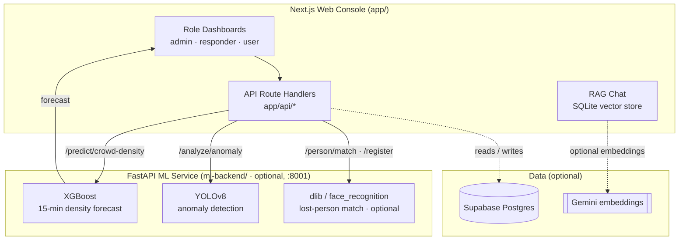

# CrowdGuard — Intelligent Event Crowd Management

[](https://nextjs.org/)
[](https://fastapi.tiangolo.com/)
[](https://xgboost.ai/)
[](https://docs.ultralytics.com/)
[-green)](https://supabase.com/)
[-purple)](https://ai.google.dev/)
[](./LICENSE)

**CrowdGuard** is an AI-assisted crowd-management platform for large events. It pairs a
Next.js web console with a Python ML microservice to move event safety from **reactive
monitoring** toward **predictive prevention** — forecasting density surges, flagging
anomalies on CCTV, planning crowd-aware routes, helping locate lost persons, and giving
responders instant, protocol-grounded answers.

> The web app runs on its own for demos — `npm install && npm run dev` — with built-in
> sample data on the dashboards. The Python ML backend and the optional Supabase/Gemini
> services light up the live AI features when you start/configure them.

---

## 🏗️ Architecture

A decoupled design: a Next.js orchestrator handles the UI and proxies AI work to an
optional FastAPI microservice, with optional Supabase (Postgres) for persistence and a
local SQLite vector store for the RAG knowledge base.



If the FastAPI service, Supabase, or Gemini are absent, the affected feature degrades
gracefully (empty/sample data or offline keyword search) rather than crashing.

---

## 🚀 Core Capabilities

1. **Predictive crowd forecasting (XGBoost).** A gradient-boosted regressor predicts
   per-zone density ~15 minutes ahead from historical density and time features.
   _Backend:_ `POST /predict/crowd-density`. _Frontend:_ `app/api/crowd-density` →
   `lib/prediction.ts`.
2. **Anomaly detection (YOLOv8).** A computer-vision pass over uploaded CCTV frames flags
   abandoned objects and unusual movement. _Backend:_ `POST /analyze/anomaly`.
   _Frontend:_ `app/api/vision`.
3. **Crowd-aware routing (Dijkstra).** Pathfinding over a venue graph weighted by
   predicted density, so routes avoid areas expected to congest. _Frontend:_
   `app/api/planned-route`.
4. **Lost-person matching (face recognition, optional).** Registers and matches 128-D
   face embeddings. Requires `dlib`/`face_recognition`; the two `/person/*` endpoints
   return HTTP 503 if those aren't installed. _Backend:_ `POST /person/register`,
   `POST /person/match`.
5. **Emergency protocol assistant (RAG).** A retrieval-augmented chatbot answers
   medical / fire / gate questions from a vectorized knowledge base
   (`lib/knowledge-base/`). Uses Gemini `text-embedding-004` when `GOOGLE_API_KEY` is
   set, otherwise high-quality offline keyword search. _Frontend:_ `app/api/chat` →
   `lib/vector-db.ts`.

---

## 🛠️ Tech Stack

- **Frontend:** Next.js 14 (App Router), React 18, TypeScript, Tailwind CSS v4,
  shadcn/ui, Recharts.
- **API layer:** Next.js Route Handlers (`app/api/*`), client-side React hooks + `fetch`.
- **ML microservice:** FastAPI (Python 3.10+) serving XGBoost, YOLOv8 (Ultralytics), and
  optional dlib/face_recognition.
- **Data:** Supabase (Postgres) — optional; SQLite (`better-sqlite3`) for the RAG vector
  store; Gemini embeddings — optional.

---

## 📂 Project Structure

```
app/                 Next.js App Router — pages + API route handlers
  api/               anomalies · chat · crowd-density · incidents · lost-persons
                     · planned-route · vision
  dashboard/         admin · responder · user dashboards
components/          UI components (shadcn/ui) + feature widgets
lib/                 database.ts (Supabase) · prediction.ts · vector-db.ts (RAG) · utils
  knowledge-base/    emergency-protocol text used by the RAG assistant
ml-backend/          FastAPI service: main.py, train_model.py, model weights
scripts/             SQL schema + seed (for Supabase)
```

---

## ⚡ Getting Started

### 1. Web app (required)

```bash
git clone https://github.com/TheClazer/crowd-management-google
cd crowd-management-google
npm install
npm run dev
```

Open http://localhost:3000. The dashboards render with built-in sample data, so you can
explore the full UI without any backend or keys.

### 2. Environment variables (optional)

Every variable is optional — the app runs without them. Copy the template and fill in
only what you need:

```bash
cp .env.example .env.local
```

| Variable | Purpose | Without it |
| --- | --- | --- |
| `NEXT_PUBLIC_SUPABASE_URL` | Supabase project URL | DB-backed API routes return empty data; dashboards still show sample data |
| `NEXT_PUBLIC_SUPABASE_ANON_KEY` | Supabase anon key | (as above) |
| `GOOGLE_API_KEY` | Gemini embeddings for the RAG assistant (`GEMINI_API_KEY` also accepted) | The chat assistant uses offline keyword search instead |

> The Supabase schema + seed live in `scripts/01-create-tables.sql` and
> `scripts/02-seed-data.sql`.

### 3. Python ML backend (optional — enables live vision & forecasting)

The web app expects the ML service on `http://localhost:8001`.

```bash
cd ml-backend
python -m venv venv

# Windows
venv\Scripts\activate
# macOS / Linux
# source venv/bin/activate

pip install -r requirements.txt
uvicorn main:app --port 8001
```

Health check: `GET http://localhost:8001/health`.

**Lost-person matching is optional** and needs `dlib` + `face_recognition` (commented out
in `requirements.txt`). They compile from source and require CMake and a C++ toolchain.
Skip them if you don't need face matching — the rest of the backend runs fine and those
endpoints simply return HTTP 503.

---

## 🔌 API Routes (`app/api/*`)

| Route | Methods | Description |
| --- | --- | --- |
| `/api/crowd-density` | GET, POST | Density history + XGBoost 15-min forecasts; sensor ingest |
| `/api/planned-route` | GET, POST | Crowd-aware Dijkstra routing over the venue graph |
| `/api/anomalies` | GET | Anomaly-detection records |
| `/api/incidents`, `/api/incidents/[id]` | GET, POST, PATCH | Incident reporting + status updates |
| `/api/lost-persons` | GET, POST | Lost-person reports |
| `/api/vision` | POST | Proxies CCTV uploads to the ML service (anomaly / face register / match) |
| `/api/chat` | GET, POST | RAG emergency-protocol assistant |

---

## 🧪 Smoke Tests

Lightweight Node scripts that hit a **running** dev server (`npm run dev`) on
`localhost:3000`:

```bash
node test_predict_api.js          # crowd-density forecast endpoint
node test_routing_integration.js  # crowd-aware routing endpoint
node test-rag.js                  # RAG assistant (/api/chat)
```

See `scripts/README.md` for the full list and prerequisites.

---

## 🔐 Demo Access

Sign-in is a **role selector for demonstration** (admin / responder / attendee) — no
password and no real authentication layer. It's intended for evaluating the dashboards,
not for production use.

---

## 📄 License

Distributed under the MIT License. See [`LICENSE`](./LICENSE).

---

**CrowdGuard** — predict the crowd, prevent the crisis.
