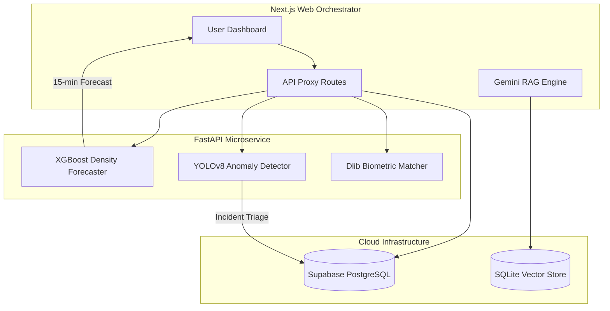

# SentinelFlow: Predictive AI Crowd Management Ecosystem

[](https://nextjs.org/)
[](https://fastapi.tiangolo.com/)
[](https://xgboost.ai/)
[](https://ultralytics.com/)
[](https://supabase.com/)
[](https://deepmind.google/technologies/gemini/)

SentinelFlow is a state-of-the-art, multi-modal AI platform designed to shift crowd management from **reactive monitoring** to **predictive prevention**. By integrating real-time computer vision, time-series forecasting, and biometric correlation, SentinelFlow provides event organizers and emergency responders with a "Predictive Risk Surface" to ensure public safety.

---

## 🏗️ System Architecture

SentinelFlow utilizes a **Heterogeneous Microservice Architecture**, decoupling high-latency AI inference from the real-time web orchestration layer.



---

## 🚀 Core Innovations

### 🔮 1. Predictive Crowd Forecasting (XGBoost)
Unlike static heatmaps, SentinelFlow predicts congestion **15 minutes before it occurs**. Using a Gradient Boosted Regressor, the system analyzes historical density, time vectors, and zone capacities to alert staff of potential bottlenecks before they materialize.

### 👁️ 2. Neural Anomaly Detection (YOLOv8)
A high-throughput computer vision pipeline that performs real-time semantic segmentation on CCTV streams. It identifies abandoned objects, unusual crowd movement, and gathering vectors with high recall.

### 🛡️ 3. Dynamic Crowd-Aware Routing (Dijkstra+)
An evolved pathfinding algorithm that calculates evacuation routes by assigning "Risk Weights" derived from **future predicted density**. It ensures users are never routed into an area expected to be congested.

### 🧬 4. Biometric Correlation Engine
A sub-second facial recognition pipeline for locating lost persons. It converts CCTV frames into 128D embeddings and performs Euclidean distance matching against a biometric registry.

### 🤖 5. Semantic Emergency Protocols (RAG)
Powered by **Gemini** and **Google Text-Embedding-004**, our RAG system provides responders with instant, context-aware advice (Medical, Fire, Security) based on a vectorized knowledge base of official protocols.

---

## 🛠️ Tech Stack

- **Framework**: Next.js 14 (App Router), React, Tailwind CSS
- **AI Microservice**: FastAPI (Python 3.10+)
- **Models**: XGBoost (Forecasting), YOLOv8 (Vision), Dlib (Biometrics), Gemini (NLP)
- **Database**: Supabase (PostgreSQL), SQLite (Vector Storage)
- **State Management**: React Query, Server Actions

---

## 📦 Installation & Setup

### 1. Clone the Repository
```bash
git clone https://github.com/TheClazer/crowd-management-google
cd crowd-management-google
```

### 2. Configure Environment
Create a `.env.local` file:
```env
NEXT_PUBLIC_SUPABASE_URL=your_supabase_url
NEXT_PUBLIC_SUPABASE_ANON_KEY=your_anon_key
GOOGLE_API_KEY=your_gemini_api_key
```

### 3. Start Python AI Backend
```bash
cd ml-backend
# Create and activate venv
python -m venv venv
./venv/Scripts/activate 
pip install -r requirements.txt
uvicorn main:app --port 8001
```

### 4. Start Next.js Frontend
```bash
# In the root directory
npm install
npm run dev
```

---

## 🧪 Integration Testing
Verify the entire AI pipeline using our built-in test suite:
- `node test_predict_api.js`: Validates XGBoost forecasting.
- `node test_routing_integration.js`: Validates crowd-aware pathfinding.
- `node test-rag.js`: Validates Gemini semantic search.

---

## 🛡️ License
Distributed under the MIT License. See `LICENSE` for more information.

**SentinelFlow** — *Out-thinking disasters before they happen.*